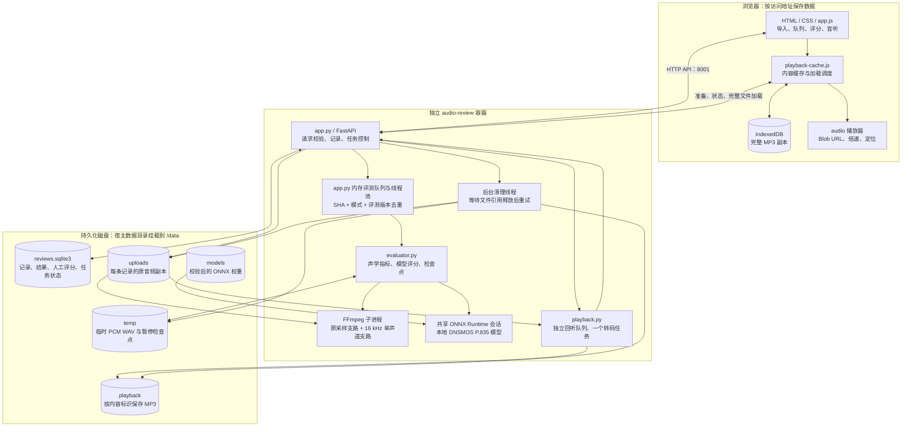
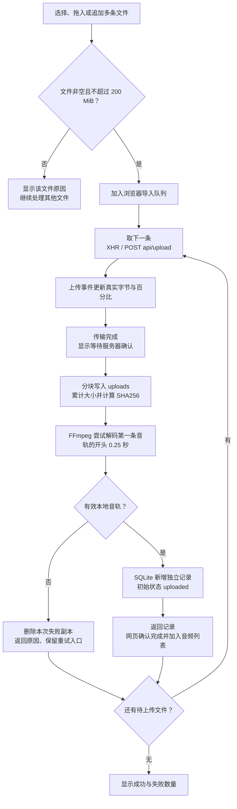
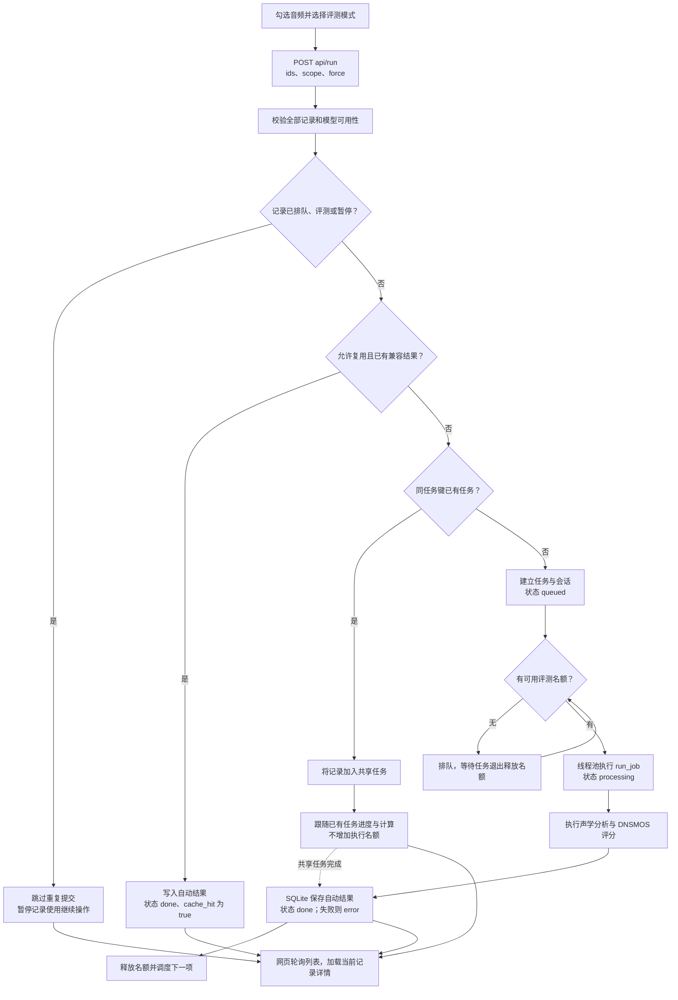
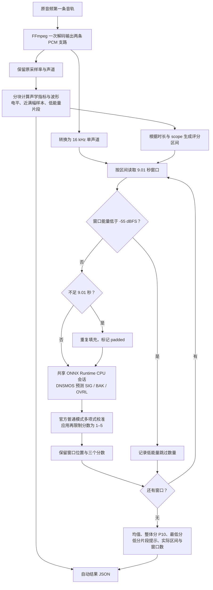
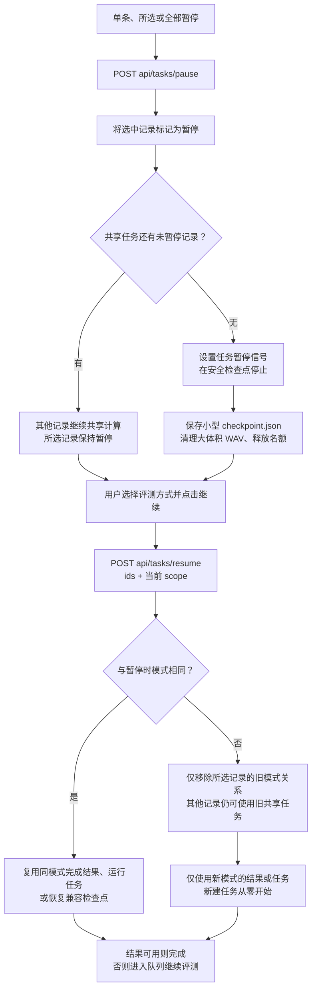
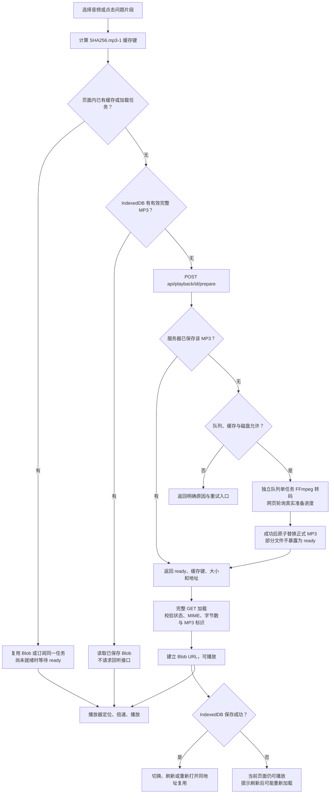
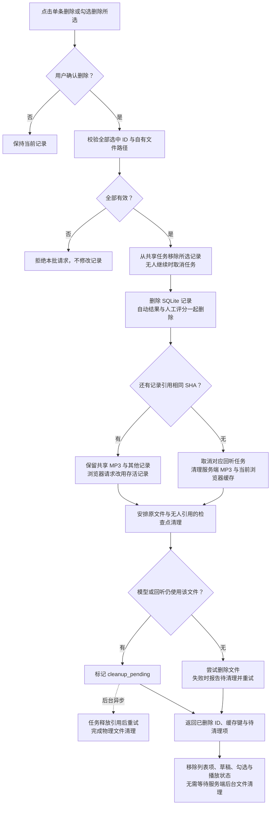
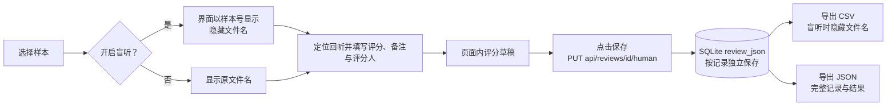
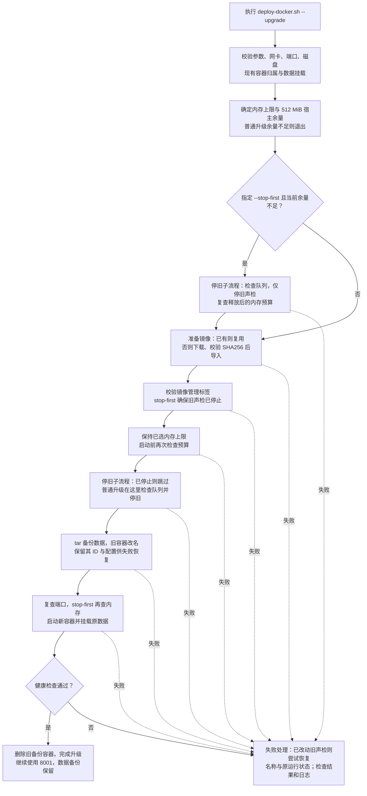
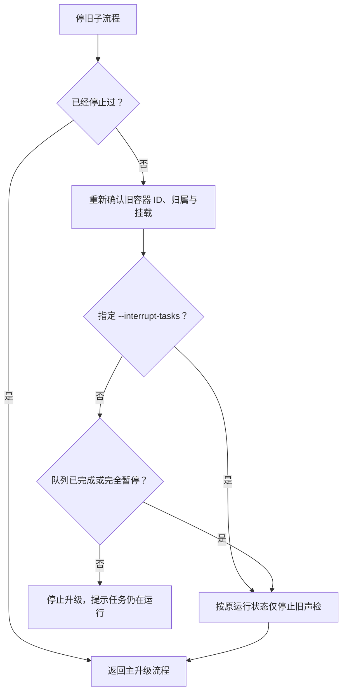

# 声检：技术架构与功能流程

本文对应 **v2.0.9** 的实际实现，从运行组件、数据存储到各项功能的请求和处理流程。图表使用 Mermaid，可在 GitHub 网页直接查看；本次文档更新不改变应用版本或部署行为。

相关文档：[使用说明](README.md)、[Docker 部署说明](Docker部署说明.md)、[验证说明](验证说明.md)。

## 1. 运行架构

声检由浏览器网页和 Python 服务组成。FastAPI 在一个 Web 服务进程中提供静态页面与 API，评测线程池执行声学分析和模型推理，独立回听线程串行调度 FFmpeg 转码。Docker 将整个声检容器的 CPU、内存和进程数限制在同一预算内。

经部署脚本启动时，Docker 默认使用 2 个评测任务、1 个模型线程；回听转码仍计入同一个容器的资源上限。评测与回听可以同时进行，回听无需等待其他评测完成。容器通常使用 0.5 核 CPU、768 或 1024 MiB 内存，无交换空间，最多 256 个进程。资源上限由部署脚本设置，直接执行裸 `docker run` 不会自动获得这些限制。具体部署前提和参数见 [Docker 部署说明](Docker部署说明.md)。

宿主的其他服务与声检各自运行，部署脚本只操作确认归属的声检容器。它们仍共享服务器的物理 CPU、磁盘和网络；资源限制与启动前余量检查用于控制竞争。

### 模块职责

| 模块 | 职责 | 关键入口 |
| --- | --- | --- |
| [static/app.js](static/app.js) | 上传进度、批量操作、列表刷新、播放交互、评分草稿 | `processUploadQueue`、`runItems`、`controlTasks`、`deleteItems` |
| [static/playback-cache.js](static/playback-cache.js) | 回听任务去重、完整加载、内存与 IndexedDB 缓存、删除时清理 | `PlaybackFiles.watch`、`run`、`download`、`removeRecords` |
| [app.py](app.py) | API、SQLite、任务分组、调度、暂停与恢复、记录删除 | `schedule_jobs`、`run_job`、`resume_tasks`、`delete_reviews` |
| [media.py](media.py) | 根据实际内容验证本地音轨，限制外部输入与协议 | `local_input_options`、`validate_audio` |
| [evaluator.py](evaluator.py) | 原音频解码、全量声学检测、DNSMOS 推理、分数聚合、检查点 | `Evaluator.evaluate`、`decode_pair`、`acoustic_analysis` |
| [playback.py](playback.py) | 兼容 MP3 转码、磁盘缓存、文件流、引用与取消 | `PlaybackCache.prepare`、`_convert`、`remove`、`stream_audio` |
| [scripts/deploy-docker.sh](scripts/deploy-docker.sh) | 下载镜像、校验、资源检查、备份、替换声检容器与失败恢复 | `--upgrade`、`--stop-first`、`--interrupt-tasks` |

## 2. 数据存储与去重标识

Docker 的数据根目录为 `/data`，默认映射到宿主 `/opt/audio-review/data`。本地运行目录可通过 `AUDIO_REVIEW_DATA_DIR` 指定。

| 位置 | 保存内容 | 生命周期 |
| --- | --- | --- |
| `uploads/<记录 ID>.<扩展名>` | 每次导入的原文件副本 | 删除记录后清理；有任务引用时延后 |
| `reviews.sqlite3` | 文件信息、SHA256、状态、进度、模式、自动结果、人工评分、暂停元信息 | SQLite 使用 WAL；记录删除时同时删除该记录的评分 |
| `models/sig_bak_ovr.onnx` | DNSMOS 权重 | 安装时校验 SHA256，运行时本地读取 |
| `temp/<会话 ID>/decoded-*.wav` | 解码的 PCM WAV | 暂停、完成、失败后清理 |
| `temp/<会话 ID>/checkpoint.json` | 已完成窗口、声学指标、下一个窗口位置、版本与模式 | 暂停时保留；失效或无人引用后清理 |
| `playback/<SHA256>.mp3-1.mp3` | 256 kbps、44.1 kHz、双声道兼容回听副本 | 重启后复用；删除最后一条内容引用时清理 |
| 浏览器 IndexedDB `audio-review-playback` | 已完整加载的兼容 MP3 Blob | 同访问地址复用；删除最后一条引用时清理当前浏览器副本 |

系统使用三种不同标识：

- **记录 ID**：每次导入独立生成。相同文件再次导入，也有自己的原文件副本、人工评分与界面状态。
- **评测任务键**：`SHA256 + scope + EVALUATOR_VERSION`。相同内容、模式与评测版本可共享计算；复用已完成结果时还检查模型 SHA256。
- **回听缓存键**：`SHA256.mp3-1`。与评测模式无关，同一内容的不同记录可复用 MP3。

`jobs`、`retired_jobs` 和待清理队列是进程内存结构。SQLite 与 JSON 检查点保存可恢复的记录状态；当前实现使用单 Web 服务进程，不应直接改为多个独立服务进程共享同一个目录。

## 3. 多文件导入与真实进度

网页可一次多选或拖入多条文件，并在上传期间继续追加。浏览器将它们排入队列，每次上传一条，避免大批量导入同时占用服务器资源。后端上传接口每次接受 1–20 条；网页的逐条请求使单条失败不会阻断后续文件。

上传百分比到 100% 只表示传输结束，还需服务器完成音轨校验和记录入库。开头校验不能证明整段文件均可解码，后续损坏会在评测或回听准备时报告。网络断开、未收到服务器确认时，应先刷新列表确认是否已入库，再决定重试。

媒体识别不依赖扩展名，实际能力取决于安装的 FFmpeg。只读取自包含本地文件的第一条音轨，禁用网络播放列表、设备和外部协议输入；损坏、加密、无音轨或解码器不支持的文件会失败。

## 4. 批量评测与队列调度

网页按最多 200 个记录 ID 拆分提交；评测任务数与所选文件数分别统计，因为相同内容的多条记录可能共享一个任务。

重新检测设置 `force=true`，跳过已完成结果缓存；同任务键正在执行时仍共享执行。自动结果可以共享，人工评分始终按记录独立保存。

列表轮询使用 `compact=true`，省略所有记录的大体积波形和逐窗口数组；网页再单独获取当前选中记录的完整结果。

## 5. 从解码到 DNSMOS 分数

### 三种评测模式

| 模式 | `scope` | 模型评测区间 | 窗口安排 |
| --- | --- | --- | --- |
| 全量快速，默认 | `fast` | 全段 | 约每 9 秒一个窗口，包含尾部，边界适当重叠 |
| 快速抽样 | `sample` | 开头 1 分钟与中段 1 分钟；不超过 2 分钟时覆盖全段 | 与全量快速相同密度 |
| 全量精细 | `full` | 全段 | 9.01 秒窗口，1 秒滑动步长，包含尾部 |

三种模式的基础声学检测都覆盖全量音频。抽样模式主要减少模型推理次数，首次解码仍需读取全段原文件。

SIG 为人声音质，BAK 为背景质量，OVRL 为整体音质。没有有效窗口时分数为空；短音频重复填充时报告可信度限制。快速与精细的统计结果可能不同，低分片段需结合原音频回听。

模型使用普通 DNSMOS P.835 的 `sig_bak_ovr.onnx`，通过 ONNX Runtime 的 CPU 执行后端推理。模型会话懒加载并共享，权重先校验 SHA256。评测原文件不会先降噪或归一化；回听 MP3 的压缩不会改变自动评分输入。

## 6. 暂停、继续与切换评测方式

暂停采用协作式检查：在解码、声学分块、评分窗口边界检查控制信号。正在推理的窗口结束后才能完全暂停，因此界面可能短暂显示 `pausing`。

同模式继续时，检查点需匹配原内容 SHA、模式、评测版本和模型版本；损坏或失效时重新开始。有效检查点包含已评分窗口与声学指标，继续仍需重新解码模型支路，但无需重算已完成的模型窗口。

换模式时不沿用旧模式的窗口、检查点或进度。目标模式已有兼容结果且允许复用时直接使用，否则加入目标模式的共享任务或创建新任务。旧任务回调按任务对象身份校验，不能覆盖新任务结果；其执行名额保留到旧工作线程完全退出，避免瞬间超过并发上限。有其他记录使用的旧共享任务仍可继续。

重启后，`paused` / `pausing` 记录保持为暂停；`queued` / `processing` 记录回到等待重新检测。当前实现不会把所有运行中的队列自动恢复为持续执行。

## 7. 回听兼容、加载与缓存复用

兼容回听将音轨转为 256 kbps MP3。服务器按内容缓存，浏览器按同一个缓存键保存完整 Blob。网页播放器使用 Blob URL，避免反复依赖原格式或远程 Range 加载。

前端按缓存键去重，切换音频只解除界面订阅，后台准备、加载与保存继续。完整文件下载串行进行，当前选中音频优先；服务端回听队列也有数量、单文件大小、时长和磁盘配额限制。

服务端 MP3 重启后复用，支持 `GET`、`HEAD`、`Range`、`ETag` 及稳定的内容版本地址。网页首次整文件下载使用 `cache: no-store`，持久副本由 IndexedDB 管理；后续回听首先查询页面内缓存和 IndexedDB。

缓存边界：

- 服务端默认回听缓存上限为 **1024 MiB 磁盘空间**，可用 `AUDIO_REVIEW_PLAYBACK_CACHE_MB` 设置为 512–16384 MiB；满额后保留旧副本并停止生成新副本。
- 页面内内存缓存以 8 个文件 / 192 MiB 为清理目标，优先保留正在播放或加载的文件；内存清理不会删除 IndexedDB 副本，这个目标不等于浏览器总内存上限。
- 浏览器存储按访问地址隔离；禁止存储、配额不足、清理网站数据或更换地址时，可能重新加载。
- MP3 有压缩损失，细致复核可下载原音频；系统不会用这个兼容副本替代原文件进行自动评分。

## 8. 单条与批量删除

界面在删除前要求确认。单条与批量接口都执行同一删除逻辑，先校验本批全部 ID、原文件路径与缓存键，再变更任务与记录。

记录删除完成后，原文件仍被模型或转码引用时会延后清理，确保其他记录可继续评测和回听。后台定期重试，启动时扫描自有文件进行孤儿清理。服务端不会递归删除数据目录里的未知文件。

删除响应在网络中丢失时，网页通过列表快照确认实际记录，清理已删除项并恢复按钮状态。每批最多 200 条，网页对更大选择拆批处理；已经成功的批次不会因为后续批次失败而自动撤销。

删除无法撤销。升级备份与其他浏览器已经保存的离线副本不会自动删除；当前浏览器清理失败时会提示用户清理网站数据。

## 9. 人工评分、盲听与导出

自动模型负责音质预测；自然度、真人感、愿继续听等业务判断由人工填写。每条记录当前有一份可修改的人工评分。

切换样本或盲听状态保留当前页面草稿，刷新或关闭网页前需保存。盲听影响文件名展示与 CSV 导出；完整 JSON 仍包含原文件名，不是匿名导出。自动模型不会生成未经验证的自然度、AI 来源或内容质量分数。

## 10. Docker 发布与安全升级

GitHub 版本标签触发镜像发布：CI 构建 Linux amd64 镜像，验证真实模型、媒体格式、并发、回听、任务控制和资源边界，导出压缩镜像与 SHA256 校验文件到 GitHub Release。CentOS 下载附件、校验并导入预构建镜像，避免在已有服务的服务器上构建。

下面描述已有声检实例的升级流程；首次部署与资源参数详见 [Docker 部署说明](Docker部署说明.md)。

图中的镜像准备包含分支：已有目标版本镜像则直接校验管理标签；不存在时下载并校验附件，`--stop-first` 在 `docker load` 前停旧并检查预算，普通升级保持旧声检运行到备份前。导入镜像后才备份数据。服务器检查宿主为 x86_64，镜像架构在发布流水线验证。

`--stop-first` 下载前也会检查一次队列。实际停旧前再次核对容器 ID、管理标记、挂载与队列，已经停止时跳过重复停止：

`--interrupt-tasks` 只跳过队列检查，归属、磁盘、备份和资源预算检查仍执行。`--stop-first` 可先释放旧声检占用的内存，停旧后仍需满足新容器内存上限加宿主余量；不足则停止并尝试恢复旧声检。

失败恢复针对旧容器及其原运行状态，不会自动解包数据备份或恢复整个数据库快照。部署不重启 Docker、不停止其他服务、不自动配置 Nginx、HTTPS 或登录；公网 NAT 地址或域名需配置允许来源。Host / Origin 校验不是用户身份认证，服务器的访问范围由网络与现有入口配置控制。

## 11. 接口与源码索引

| 功能 | 接口 | 服务端 / 前端入口 |
| --- | --- | --- |
| 页面与健康状态 | `GET /`、`GET /api/health` | `home`、`health` |
| 导入 | `POST /api/upload` | `upload` / `sendUpload` |
| 列表与单条详情 | `GET /api/reviews`、`GET /api/reviews/{id}` | `list_reviews`、`review_detail` / `refresh` |
| 提交评测 | `POST /api/run` | `run` / `runItems` |
| 暂停 | `POST /api/tasks/pause` | `pause_tasks` / `controlTasks` |
| 继续与换模式 | `POST /api/tasks/resume` | `resume_tasks` / `controlTasks` |
| 准备与查询回听 | `POST /api/playback/{id}/prepare`、`GET /api/playback/{id}/status` | `prepare_playback`、`get_playback_status` / `PlaybackFiles.run` |
| 加载兼容回听 | `GET`、`HEAD /api/playback/{id}/audio?key=...` | `compatible_audio`、`stream_audio` / `PlaybackFiles.download` |
| 下载原音频 | `GET`、`HEAD /api/audio/{id}` | `audio`、`stream_audio` |
| 删除 | `DELETE /api/reviews/{id}`、`POST /api/reviews/delete` | `delete_reviews` / `deleteItems` |
| 保存人工评分 | `PUT /api/reviews/{id}/human` | `save_review` / `saveHumanReview` |
| 导出 | `GET /api/export.csv`、`GET /api/export.json` | `export_csv`、`export_json` |

接口路径中的 `{id}` 表示记录 ID；流程图中的 `id` 是占位写法。当前使用轮询刷新进度，没有 WebSocket 依赖。回听接口的流式响应支持范围读取，而网页完整加载后使用本地 Blob 播放。

## 12. 验证与维护

[验证说明](验证说明.md)记录模型与速度验证方式、并发资源检查、任务控制、模式切换、删除和回听复用的测试边界。主要自动验证脚本为：

- [scripts/smoke-test.py](scripts/smoke-test.py)：真实模型与基本接口。
- [scripts/media-smoke-test.py](scripts/media-smoke-test.py)：音频与视频音轨格式兼容。
- [scripts/parallel-smoke-test.py](scripts/parallel-smoke-test.py)：并发评测、缓存与资源采样。
- [scripts/task-control-smoke-test.py](scripts/task-control-smoke-test.py)：暂停、继续、检查点、忙时回听与重启复用。
- [scripts/record-actions-smoke-test.py](scripts/record-actions-smoke-test.py)：换模式、删除、共享引用保留与清理。
- [scripts/interrupt-upgrade-smoke-test.py](scripts/interrupt-upgrade-smoke-test.py)：只替换声检实例的强制升级。

模型分数仍需用实际中文播客和人工评分校准。功能流程、资源测试与速度基准验证的是实现行为，不代表模型符合业务评分标准。
